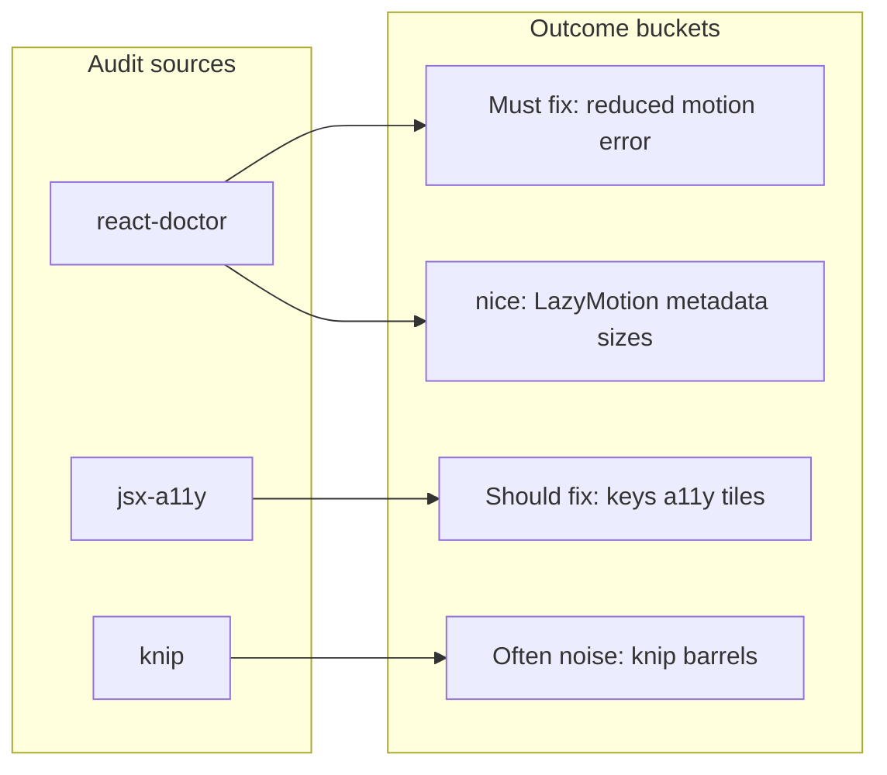

# React-doctor folder: findings and what to improve

## Verdict

**Yes — there are meaningful improvements**, especially one **accessibility error** and several **a11y / list-key / bundle** warnings. A large block of **knip** output is **optional cleanup** or **expected noise** (shadcn barrel re-exports, WIP modules).

The canonical source is `[diagnostics.json](/tmp/react-doctor-2c8d26e5-2fc5-4bb5-be99-1c2912f25e29/diagnostics.json)` (~100+ entries). Per-rule rollups live in the sibling `.txt` files (`knip--*.txt`, `react-doctor--*.txt`, `jsx-a11y--*.txt`).

---

## High priority (do not ignore)

### 1. `require-reduced-motion` (severity: **error**)

- **Where:** `package.json` (project-level rule in the report).
- **Issue:** App uses a motion library (framer-motion) without documented `prefers-reduced-motion` handling (WCAG 2.3.3).
- **Direction:** Add global handling: e.g. `useReducedMotion()` from framer-motion at animation boundaries, and/or CSS `@media (prefers-reduced-motion: reduce)` to disable or shorten motion. Often paired with **LazyMotion** (see below).

### 2. List keys (`no-array-index-as-key`)

- **Files called out:** e.g. `[components/vault/gallery/vault-file-gallery.tsx](components/vault/gallery/vault-file-gallery.tsx)`, `[components/dashboard/bookmark-list/bookmark-row-main.tsx](components/dashboard/bookmark-list/bookmark-row-main.tsx)`, `[components/landing/bookmark-list.tsx](components/landing/bookmark-list.tsx)`, `[components/dashboard/bookmark-list/index.tsx](components/dashboard/bookmark-list/index.tsx)`, `[components/dashboard/bookmark-list/menu.tsx](components/dashboard/bookmark-list/menu.tsx)`, `[components/ui/password-input.tsx](components/ui/password-input.tsx)`, `[components/dashboard/dialog/keyboard-shortcuts-dialog.tsx](components/dashboard/dialog/keyboard-shortcuts-dialog.tsx)`.
- **When it matters:** Reorder, filter, or insert — index keys cause wrong reconciliation. Prefer stable ids (`bookmark._id`, file id, etc.); where the list is static and never reordered, index is sometimes acceptable but the linter is right to flag it.

### 3. Clickable non-interactive elements (jsx-a11y)

- **Pairs:** `click-events-have-key-events` + `no-static-element-interactions` on `[components/vault/gallery/stored-file-tile.tsx](components/vault/gallery/stored-file-tile.tsx)`, `[components/vault/gallery/upload-file-tile.tsx](components/vault/gallery/upload-file-tile.tsx)`, `[components/layout/header.tsx](components/layout/header.tsx)`; related warnings on `[components/vault/gallery/vault-tile-preview.tsx](components/vault/gallery/vault-tile-preview.tsx)`.
- **Direction:** Prefer `<button type="button">` or `<a href=...>` for actions; if a `div` must be clickable, add `role`, `tabIndex={0}`, and keyboard handler (`onKeyDown` Enter/Space), or use a Radix/shadcn primitive that already handles this.

---

## Medium priority (worth doing selectively)

### 4. Framer Motion bundle (`use-lazy-motion`)

- **Many files** import full `motion`; report suggests `LazyMotion` + `m` + `domAnimation` (~30kb savings repeated per entry — in practice one provider at layout level).
- **Files:** e.g. `[app/page.tsx](app/page.tsx)`, `[components/dashboard/index.tsx](components/dashboard/index.tsx)`, `[components/landing/features-section.tsx](components/landing/features-section.tsx)`, `[components/landing/bookmark-list.tsx](components/landing/bookmark-list.tsx)`, vault/landing/dashboard bookmark components.

### 5. Next.js metadata and images

- **Missing metadata:** `[app/page.tsx](app/page.tsx)`, `[app/vault/page.tsx](app/vault/page.tsx)` — add `metadata` or `generateMetadata` for SEO.
- `**next/image` `fill` without `sizes`:** `[components/landing/bookmark-list.tsx](components/landing/bookmark-list.tsx)` — add `sizes` matching layout breakpoints.
- `**nextjs-no-img-element`:** `[components/vault/gallery/vault-tile-preview.tsx](components/vault/gallery/vault-tile-preview.tsx)`, `[components/vault/image-lightbox.tsx](components/vault/image-lightbox.tsx)`, `[components/dashboard/bookmark-list/favicon-icon.tsx](components/dashboard/bookmark-list/favicon-icon.tsx)`. **Note:** blob/data URLs, some third-party patterns, or lightboxes sometimes justify ``; evaluate per case rather than blindly swapping.

### 6. `no-inline-prop-on-memo-component` (`[components/landing/bookmark-list.tsx](components/landing/bookmark-list.tsx)`)

- Memoized `DesktopRow` receives inline callbacks/objects — defeats `memo` if props change every render. Stabilize handlers (lift, `useCallback` only where measured need) or pass fewer inline objects.

### 7. `no-autofocus` (`[components/landing/rename-bookmark-dialog.tsx](components/landing/rename-bookmark-dialog.tsx)`)

- Remove `autoFocus` or replace with focus management (e.g. dialog open → focus trap / `requestAnimationFrame` focus) for better a11y.

---

## Lower priority / architectural hints (optional)

- `**no-giant-component`:** `[components/dashboard/index.tsx](components/dashboard/index.tsx)` (`DashboardPage` ~~396 lines), `[components/vault/gallery/upload-file-tile.tsx](components/vault/gallery/upload-file-tile.tsx)` (~~333 lines).
- `**prefer-useReducer`:** six `useState` in `DashboardPage` — only refactor if state transitions are tangled; not mandatory.
- `**no-prevent-default`:** forms and `[components/dashboard/bookmark-list/bookmark-item.tsx](components/dashboard/bookmark-list/bookmark-item.tsx)` anchor — rule pushes server actions / progressive enhancement; for a client-heavy Convex app, many teams **accept** `preventDefault` and treat as stylistic.
- `**react/no-children-prop`:** `[components/dialogs/create-group-dialog.tsx](components/dialogs/create-group-dialog.tsx)`, `[components/dialogs/rename-group.tsx](components/dialogs/rename-group.tsx)`, settings components — often **false positives** when a library API uses a `children` prop explicitly; fix only if it matches real anti-patterns in your code.

---

## Knip / dead code (interpret carefully)

From `[knip--files.txt](/tmp/react-doctor-2c8d26e5-2fc5-4bb5-be99-1c2912f25e29/knip--files.txt)` and exports/types in `[diagnostics.json](/tmp/react-doctor-2c8d26e5-2fc5-4bb5-be99-1c2912f25e29/diagnostics.json)`:

- **“Unused files”** include paths like `password-section.tsx`, `password-input.tsx`, and import-related hooks — your **current** repo may already import these (git status shows active work). **Re-run knip** on today’s tree before deleting anything.
- **Unused exports** on shadcn files (`dropdown-menu`, `select`, `alert-dialog`, etc.) are **usually normal** — re-exported for API parity; trimming can break future usage.
- `**lib/bookmark-import.ts` / `lib/validation.ts` exports** flagged unused may reflect **WIP** or **scripts-only** usage — verify grep / test scripts before removing.

---

## Summary diagram (report structure)

---

## Bottom line

- **There are real improvements:** treat `**require-reduced-motion`** as the top item, then **stable list keys** and **clickable-element a11y**.
- **Treat knip “unused” with skepticism** until reconciled with the current codebase; **do not** strip shadcn re-exports without a deliberate policy.

If you want implementation next, the highest leverage sequence is: **reduced motion + LazyMotion**, then **keys + div-as-button fixes**, then **metadata / `sizes` / image audit**.